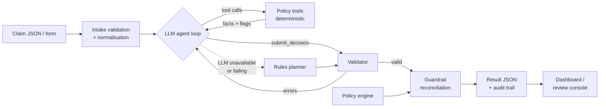

# Travel Reimbursement Approval Agent

An agentic GenAI prototype that reviews employee travel reimbursement claims against a travel policy. For each claim it returns a structured, policy-cited decision: **APPROVE**, **PARTIAL_APPROVE**, **REJECT** or **MANUAL_REVIEW**.

> **Deliverable:** [`satyanarayansharma.ipynb`](satyanarayansharma.ipynb) is a single, self-contained notebook that runs top-to-bottom.
> **Author:** Satyanarayan Sharma · **Detailed docs:** [`docs/TECHNICAL_DOCUMENTATION.md`](docs/TECHNICAL_DOCUMENTATION.md)


---

## Results on the five sample claims

| Claim | Employee | Decision | Approved | Deducted | Why |
|---|---|---|---|---|---|
| CLM-001 | A. Rivera | ✅ APPROVE | \$1,110.00 | \$0.00 | Everything is eligible and receipted, within caps, and in the manager tier (POL-APR-02) |
| CLM-002 | B. Osei | ❌ REJECT | \$0.00 | \$380.00 | Spa and minibar are ineligible (POL-CAT-02) |
| CLM-003 | C. Nakamura | 🟡 PARTIAL_APPROVE | \$840.00 | \$100.00 | Lodging of \$500 is over the \$400 cap for 2 nights (POL-PD-02) |
| CLM-004 | D. Fischer | 🔵 MANUAL_REVIEW | \$0.00 | \$0.00 | Business class, missing hotel receipt, total over \$2,000, and 3 nights claimed on a 2-night trip |
| CLM-005 | E. Haddad | 🔵 MANUAL_REVIEW | \$0.00 | \$0.00 | \$220 receipt missing, and a hosted client meal that the per-diem doesn't clearly cover |

For MANUAL_REVIEW, the agent approves nothing because it has no authority to. The amount is **held for review** (\$3,220 across the two claims).

---

## How it works



1. **Intake** validates the claim schema, normalises categories, and reads quantities such as "2 nights" from the descriptions.
2. **The LLM agent** decides which tools to call, often several in parallel, and grounds its reasoning with `search_policy`.
3. **The tools** are deterministic. They do all the arithmetic and apply the hard rules, and they return facts, flags and the rules they applied.
4. **`submit_decision`** is validated. Invalid rule ids, skipped checks, ignored flags and invented dollar figures are sent back to the LLM so it can correct itself.
5. **The guardrail** recomputes the decision from the policy. The LLM may **escalate** to manual review, but it can never downgrade one.
6. **Output:** one JSON object per claim, plus an audit trail of every retrieval, tool call, validation and override.

### Tools available to the agent
| Tool | Policy rules | Returns |
|---|---|---|
| `search_policy` | all | Matching rule text (BM25; exact `POL-*` lookup) |
| `check_category_eligibility` | POL-CAT-01/02 | Line status, ineligible total, business-purpose check |
| `check_receipts` | POL-RCT-01/02 | Receipt requirement per line, missing docs |
| `check_per_diem_limits` | POL-PD-01/02/03, POL-AIR-01 | Cap, allowed and excess per line; reimbursable total |
| `check_submission_timeliness` | POL-TIME-01 | Days since expense, whether inside the 30-day window |
| `check_approval_threshold` | POL-APR-01/02/03 | Approval tier for the reimbursable total |
| `submit_decision` | – | Final decision (validated) |

---

## Quick start

**Requirements:** Python 3.10+ and Jupyter. An LLM API key is optional.

```bash
git clone <this-repo-url>
cd <repo-folder>
python -m venv .venv
# Windows: .venv\Scripts\activate    macOS/Linux: source .venv/bin/activate
pip install -r requirements.txt

# Create a local .env file in this folder with:
# LLM_PROVIDER=groq
# GROQ_API_KEY=gsk_...
# AGENT_MODE=auto

jupyter notebook satyanarayansharma.ipynb
# Kernel → Restart & Run All
```

- **No key?** The notebook runs in deterministic `rules` mode and produces the same decisions without any LLM.
- **With a key,** the LLM drives tool selection and writes the explanations. Each result shows its source, e.g. `llm:llama-3.3-70b-versatile`.

The notebook loads `.env` from the project folder with `python-dotenv`. Keep this file local and never commit it. If the key was added after the notebook kernel started, restart the kernel and use **Run All** so the configuration cell reloads the environment variables.

### Configuration

| Variable | Default | Description |
|---|---|---|
| `LLM_PROVIDER` | `groq` | `groq` · `gemini` · `ollama` · `openai` |
| `LLM_API_KEY` | – | Generic key; `GROQ_API_KEY`, `GEMINI_API_KEY` and `OPENAI_API_KEY` are also read |
| `LLM_MODEL` | provider default | Must support tool/function calling |
| `LLM_BASE_URL` | provider default | Any OpenAI-compatible endpoint |
| `AGENT_MODE` | `auto` | `auto` (LLM if configured) · `llm` (fail if no LLM) · `rules` |
| `LLM_PAUSE_SECONDS` | `8` on Groq | Delay between claims, for free-tier rate limits |

| Provider | Default model | Key |
|---|---|---|
| Groq (free tier) | `llama-3.3-70b-versatile` | [console.groq.com](https://console.groq.com) |
| Gemini (free tier) | `gemini-2.5-flash` | [aistudio.google.com](https://aistudio.google.com) |
| Ollama (local) | `qwen2.5:7b-instruct` | none. Run `ollama pull qwen2.5:7b-instruct` first |
| OpenAI | `gpt-4.1-mini` | platform.openai.com |

Model catalogues change often. If a default model has been retired, set `LLM_MODEL` to any current model that supports tool calling.

---

## Using the agent

**Notebook UI:** the *Dashboard* section has a claim review console. Pick a claim, or paste a claim as JSON, choose LLM or rules mode, and click **Evaluate**. The result card shows the decision, amounts, explanation and a collapsible audit trail.

**Programmatic use** (inside the notebook kernel):
```python
result, audit = review_claim({
    "claim_id": "CLM-NEW-01", "employee": "J. Doe", "purpose": "Client workshop (business)",
    "trip_start": "2026-06-01", "trip_end": "2026-06-02", "submitted": "2026-06-05",
    "items": [{"category": "taxi", "description": "Airport taxi", "amount": 40.0, "receipt_attached": True}]
})
print(result["decision"])      # APPROVE
audit.frame()                  # full audit trail as a DataFrame
```

**Output format** (the last notebook cell prints one object per claim):
```json
{
  "claim_id": "CLM-003",
  "decision": "PARTIAL_APPROVE",
  "approved_amount": 840.0,
  "deducted_amount": 100.0,
  "missing_docs": [],
  "policy_refs": ["POL-CAT-01", "POL-PD-01", "POL-PD-02", "POL-AIR-01", "POL-RCT-01", "POL-APR-02", "POL-TIME-01"],
  "confidence": 0.95,
  "explanation": "The claim is valid, receipts are attached and it was submitted on time, but lodging $500.00 exceeds the $400.00 cap for 2 nights (POL-PD-02), so $100.00 is deducted. ...",
  "tools_used": ["check_category_eligibility", "check_receipts", "check_per_diem_limits", "check_submission_timeliness", "check_approval_threshold", "search_policy", "submit_decision"]
}
```

---

## Notebook structure

| Section | What it covers |
|---|---|
| README | Setup, env vars, output schema, reason codes |
| 1. Setup & configuration | Auto-install, provider selection, run mode |
| 2. Policy knowledge base | `POL-*` rules, limit table, approval matrix, BM25 retriever |
| 3. Claim intake | The Appendix B claims as JSON, plus validation and normalisation |
| 4. Tools | Deterministic checks, JSON tool schemas, audit logging |
| 5. Policy guardrail | Decision engine and template explanations |
| 6. Agent | System prompt, tool-calling loop, validator, rules fallback, reconciliation |
| 7–9. Run, samples, audit | Results for all 5 claims, explanations, CLM-004 audit trail |
| 10. Evaluation & tests | Assertions, edge cases, accuracy report |
| Dashboard | KPIs, charts, `UI SS_1.png`, interactive review console, result cards |
| Design Notes & Reasoning | Assumptions, trade-offs, manual-review rationale, limitations, next steps |
| Final structured results | The required JSON array |

## Repository layout
```
.
├── satyanarayansharma.ipynb          # the deliverable (single notebook)
├── UI SS_1.png                       # dashboard screenshot (generated by the notebook)
├── README.md                         # this file
├── docs/TECHNICAL_DOCUMENTATION.md   # architecture, tool reference, decision logic
├── requirements.txt
├── .env                               # local API keys; never commit this file
└── .gitignore
```

---

## Testing

Section 10 of the notebook runs automatically and covers:
- **Hard assertions:**
  - the policy engine matches the expected decisions and amounts for all 5 claims;
  - every result passes the output contract;
  - the final decision is never less strict than the guardrail's;
  - retrieval returns the right rules;
  - the validator catches hallucinated amounts and unknown rule ids.
- **Edge cases:** one-field variants of CLM-001 cover a late submission, an added minibar charge, an airfare line with no cabin class, and a mismatched total.
- **Report:** the agent's decisions compared with the expected outcomes, including which path (LLM or rules) produced each one.

The LLM loop was also tested against a mocked OpenAI client. The scenarios were:
- parallel tool calls;
- a text-only turn;
- a hallucinated amount, which the agent then corrected;
- skipped checks and an unknown rule id;
- a tool call for the wrong claim;
- a guardrail override;
- an accepted escalation;
- retry exhaustion leading to fallback;
- an auth error tripping the circuit breaker.

## Key design decisions
- **Direct OpenAI-compatible tool calling, not LangChain/LangGraph.** There are six tools and one loop; a framework would add weight without adding capability, and this way the code is portable across Groq, Gemini, Ollama and OpenAI.
- **The LLM orchestrates; code calculates.** Money math and hard rules never depend on model output.
- **Validated structured output.** Decisions arrive through a tool call with self-correction, not by parsing free text.
- **Escalate-only guardrail.** Safety is enforced by construction, not only by the prompt.
- **Manual review by default when uncertain,** with reason codes, as the policy's own guidance says.
- **BM25 over 12 rules instead of a vector database.** Retrieval is exact, deterministic and dependency-free.

## Limitations & roadmap
- **Limitations:**
  - receipts are trusted as flagged, with no OCR;
  - line items are totals, not per-day entries;
  - there is no cross-claim duplicate detection;
  - keyword heuristics can miss paraphrases;
  - it is a prototype, with no authentication or persistence.
- **Next steps:**
  - receipt OCR, reconciled against line items;
  - LangGraph with `interrupt()` for reviewer loops;
  - tools exposed through an MCP server;
  - a labelled evaluation set of 50+ claims, used for confidence calibration;
  - duplicate detection;
  - policy versioning.

See [`docs/TECHNICAL_DOCUMENTATION.md`](docs/TECHNICAL_DOCUMENTATION.md) for the full reference.

---

*Mock policy and claims only; no real employee or company data.*
# hcltech-genai

# hcltech-genai

