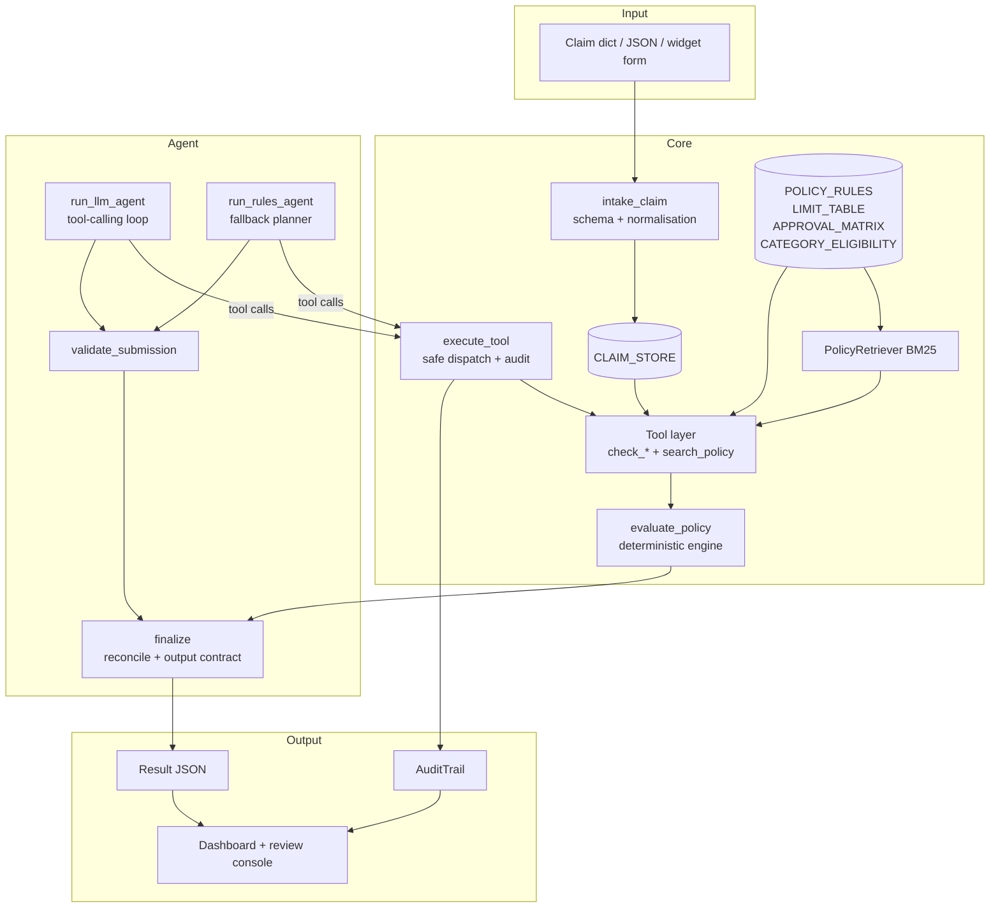
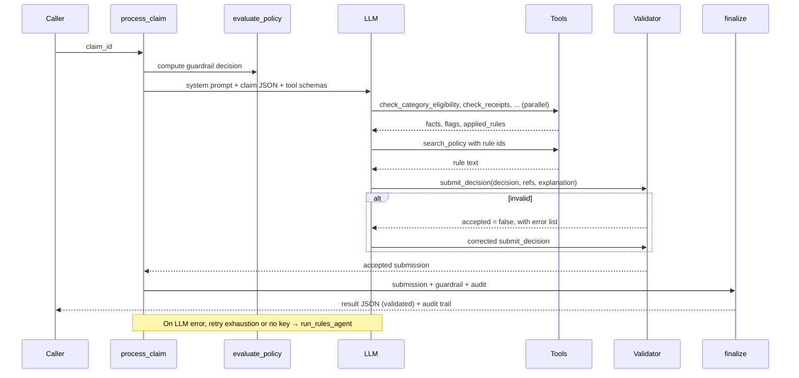

# Technical Documentation: Travel Reimbursement Approval Agent

| | |
|---|---|
| **Author** | Satyanarayan Sharma |
| **Deliverable** | `satyanarayansharma.ipynb` (single notebook) |
| **Policy** | Assignment Appendix A (mock policy, rule ids `POL-*`) |
| **Claims** | Assignment Appendix B (CLM-001 … CLM-005) |
| **Stack** | Python 3.10+, OpenAI-compatible chat completions with tool calling, pandas, matplotlib, ipywidgets |

## Contents
1. [Purpose and scope](#1-purpose-and-scope)
2. [Architecture](#2-architecture)
3. [End-to-end flow](#3-end-to-end-flow)
4. [Data model](#4-data-model)
5. [Policy knowledge base and retrieval](#5-policy-knowledge-base-and-retrieval)
6. [Tool reference](#6-tool-reference)
7. [Flags and reason codes](#7-flags-and-reason-codes)
8. [Decision logic](#8-decision-logic)
9. [Agent loop](#9-agent-loop)
10. [Validation, reconciliation and confidence](#10-validation-reconciliation-and-confidence)
11. [Reliability and error handling](#11-reliability-and-error-handling)
12. [Worked examples](#12-worked-examples)
13. [Testing and evaluation](#13-testing-and-evaluation)
14. [Configuration and providers](#14-configuration-and-providers)
15. [Extending the system](#15-extending-the-system)
16. [Assumptions, limitations and roadmap](#16-assumptions-limitations-and-roadmap)
17. [Troubleshooting](#17-troubleshooting)

---

## 1. Purpose and scope

The agent evaluates travel reimbursement claims against a written policy. For each claim it returns a decision (`APPROVE`, `PARTIAL_APPROVE`, `REJECT` or `MANUAL_REVIEW`), the approved and deducted amounts, the missing documents, the policy references, a confidence score, an explanation, and the tools it used.

**Goals:**
- the LLM genuinely orchestrates tools;
- decisions are grounded in cited policy;
- arithmetic is deterministic;
- output is strictly structured;
- uncertain cases are routed safely to manual review.

**Non-goals:**
- production concerns such as authentication, persistence, multi-tenant use and PII handling;
- receipt OCR;
- ERP integration.

The assignment asks for a small, well-explained, working prototype, so the design stays deliberately lightweight.

---

## 2. Architecture



| Component | Responsibility | Notebook section |
|---|---|---|
| `build_llm_client` | Chooses the provider and model from env vars, and decides the run mode (`llm` / `rules`) | 1 |
| `POLICY_RULES` + tables | Policy text with stable ids, and the machine-readable limits, tiers and category lists | 2 |
| `PolicyRetriever` | In-memory BM25 search with exact `POL-*` id lookup | 2 |
| `intake_claim` | Schema validation, normalisation, quantity parsing, data-quality issues | 3 |
| `check_*` functions | Deterministic policy checks returning facts, flags and applied rules | 4 |
| `TOOL_REGISTRY` / `AGENT_TOOLS` | JSON-schema tool definitions exposed to the LLM | 4 |
| `execute_tool` | Safe dispatch (errors returned, not raised), claim-id scoping, audit logging | 4 |
| `AuditTrail` | Per-claim event log, token usage, source, reason codes, held amount | 4 |
| `evaluate_policy` | Decision engine used as guardrail, fallback and test oracle | 5 |
| `template_explanation` | Explanation built only from tool facts | 5 |
| `run_llm_agent` | LLM tool-calling loop with self-correction | 6 |
| `validate_submission` | Checks on the `submit_decision` payload | 6 |
| `run_rules_agent` | Deterministic planner using the same tools | 6 |
| `finalize` / `validate_result` | Guardrail reconciliation, output assembly, output contract | 6 |
| `process_claim` / `review_claim` | Orchestration and the API-style entry point | 6 |
| Dashboard / console | KPIs, charts, `UI SS_1.png`, ipywidgets console, result cards | Dashboard |

---

## 3. End-to-end flow



Processing steps for one claim:
1. `evaluate_policy(claim_id)` computes the reference decision and logs a `guardrail` event.
2. In LLM mode, and if the circuit breaker is closed, `run_llm_agent` runs for up to 8 turns.
3. If there is no LLM, or the LLM fails, `run_rules_agent` produces the submission instead.
4. `finalize` reconciles the submission with the guardrail, assembles the output, and validates the contract.

---

## 4. Data model

### 4.1 Input claim

| Field | Type | Required | Notes |
|---|---|---|---|
| `claim_id` | str | yes | Unique id |
| `employee` | str | yes | |
| `purpose` | str | yes | Checked for a documented business reason |
| `trip_start`, `trip_end`, `submitted` | str (ISO date) | yes | `YYYY-MM-DD` |
| `items` | list | yes | At least one |
| `items[].category` | str | yes | Lower-cased. Spaces and hyphens become `_`. Aliases are mapped (e.g. `taxi` → `ground_transport`) |
| `items[].description` | str | yes | Quantities such as "2 nights" or "3 days" are parsed from it |
| `items[].amount` | number or numeric string | yes | Rounded to cents |
| `items[].receipt_attached` | bool or "Yes"/"No" | yes | |
| `total_claimed` | number | no | Cross-checked against the sum of the items |
| `currency` | str | no | Default `USD`; any other value is flagged |

### 4.2 Normalised claim (added by intake)

| Field | Meaning |
|---|---|
| `trip_days` | `(end − start) + 1` (inclusive) |
| `trip_nights` | `max(end − start, 0)` |
| `items[].line` | 1-based line number |
| `items[].quantity`, `items[].quantity_unit` | Parsed from the description, or `None` |
| `total_claimed` | Recomputed sum of the items |
| `data_issues` | Soft problems, which become `DATA_QUALITY` flags |
| `_start`, `_end`, `_submitted` | Internal `date` objects (excluded from LLM prompts) |

`IntakeError` is raised for missing or mistyped fields, an empty `items` list, invalid JSON, invalid dates, a non-numeric amount, or a reused `claim_id` with different data (in `review_claim`).

### 4.3 Output object (exact field order)

| Field | Type | Rules |
|---|---|---|
| `claim_id` | str | Must exist in the store |
| `decision` | enum | One of the four decisions |
| `approved_amount` | float | ≥ 0. `> 0` for APPROVE/PARTIAL; `0` for REJECT/MANUAL_REVIEW |
| `deducted_amount` | float | ≥ 0. `0` for APPROVE; `> 0` for PARTIAL |
| `missing_docs` | list[str] | Filled only for MANUAL_REVIEW |
| `policy_refs` | list[str] | Known `POL-*` ids, in policy order |
| `confidence` | float | In [0, 1] |
| `explanation` | str | Prefixed with `[REASON_CODES]` for MANUAL_REVIEW |
| `tools_used` | list[str] | Unique, in call order, `submit_decision` last |

Invariant: `approved_amount + deducted_amount ≤ total_claimed`. The difference is the **held amount**, which appears in the audit trail and on the dashboard.

### 4.4 Audit trail events

| Event | Fields | Logged by |
|---|---|---|
| `guardrail` | decision, flags | `process_claim` |
| `tool_call` | caller (`llm`/`planner`), tool, args, applied_rules, flags, error, ms | `execute_tool` |
| `llm_turn` | turn, tool_calls, note | `run_llm_agent` |
| `llm_error` | attempt, status, error | `_chat` |
| `validation` | tool, decision, result (`accepted`/`rejected`), error | agent loops |
| `reconcile` | agent_decision, guardrail_decision, final, result | `finalize` |
| `fallback` | error | `process_claim` |

`AuditTrail` also holds these attributes: `source` (e.g. `llm:<model>`, `rules`, `rules (LLM fallback)`), `reason_codes`, `held_amount`, and `usage` (`llm_calls`, `prompt_tokens`, `completion_tokens`).

---

## 5. Policy knowledge base and retrieval

### 5.1 Rules
Each rule in `POLICY_RULES` has an `id`, a `title` and its `text`. A non-citable `GUIDANCE` entry holds the policy's decision guidance. Citable ids:

`POL-CAT-01`, `POL-CAT-02`, `POL-PD-01`, `POL-PD-02`, `POL-PD-03`, `POL-AIR-01`, `POL-RCT-01`, `POL-RCT-02`, `POL-APR-01`, `POL-APR-02`, `POL-APR-03`, `POL-TIME-01`

### 5.2 Machine-readable tables

| Table | Content |
|---|---|
| `LIMIT_TABLE` | meals \$75/day (POL-PD-01) · lodging \$200/night (POL-PD-02) · ground transport \$50/day (POL-PD-03) |
| `APPROVAL_MATRIX` | ≤ \$500 auto (POL-APR-01, agent may approve) · ≤ \$2,000 manager (POL-APR-02, agent may approve) · above that, director (POL-APR-03, agent may not approve) |
| `CATEGORY_ELIGIBILITY` | eligible: airfare, lodging, meals, ground_transport, conference_fees · ineligible: alcohol, minibar, spa, gym, entertainment, in-room movies, shopping, gifts, fines, penalties, late fees, personal · aliases |
| `RECEIPT_RULES` | threshold \$25; always required for airfare and lodging |
| `SUBMISSION_WINDOW_DAYS` | 30 |

Heuristic patterns (these raise *ambiguity* flags only):

| Pattern | Used for |
|---|---|
| `BUSINESS_PURPOSE_PATTERN` | Detecting a stated business reason in `purpose` |
| `INELIGIBLE_TERMS_PATTERN` | Catching ineligible words inside eligible lines |
| `GROUP_MEAL_PATTERN` | Detecting hosted or group meals |

### 5.3 Retrieval
`PolicyRetriever` is a BM25 index (k1 = 1.5, b = 0.75) over `id + title + text`. Any exact `POL-*` ids in the query are returned first, followed by the BM25-ranked rules.

**Why BM25:**
- With 12 short rules, lexical matching is exact, deterministic, explainable and needs no dependencies.
- An embedding model plus a vector store would add setup and nondeterminism without better recall at this size.
- For a real, multi-document policy, the component can be swapped for embeddings with a reranker without changing the tool interface.

---

## 6. Tool reference

All claim tools take `{"claim_id": "<id>"}`. They return JSON with `flags` (see §7) and `applied_rules`. A call for a different claim than the one under evaluation returns an error.

### `search_policy`
- **Input:** `query` (str), optional `top_k` (int, default 3)
- **Output:** `{query, results: [{id, title, text}]}`
- **Purpose:** grounding and citation

### `check_category_eligibility`
- **Output:**

  | Field | Meaning |
  |---|---|
  | `lines[]` | `{line, category, description, amount, status}`, where status is `eligible`, `ineligible`, `suspect` or `unknown` |
  | `reimbursable_candidate_lines` | Number of lines that are not ineligible |
  | `ineligible_total` | Sum of the ineligible lines |

- **Flags:** `INELIGIBLE_TERM`, `UNKNOWN_CATEGORY`, `BUSINESS_PURPOSE_UNCLEAR` (only if a candidate line exists), `DATA_QUALITY`
- **Rules:** POL-CAT-01, POL-CAT-02

### `check_receipts`
Evaluates only lines that are not ineligible.
- **Output:** `lines[]` as `{line, category, amount, receipt_required, receipt_attached, ok}`, plus `missing_docs[]`
- **Required when:** `amount > 25`, or the category is airfare or lodging
- **Flags:** `RECEIPT_MISSING` (hard)
- **Rules:** POL-RCT-01, plus POL-RCT-02 if anything is missing

### `check_per_diem_limits`
- **Output:**

  | Field | Meaning |
  |---|---|
  | `lines[]` | `{line, category, claimed, cap, allowed, excess, headroom, basis}` |
  | `total_excess` | Sum of excess across lines |
  | `reimbursable_total` | Sum of allowed amounts |
  | `extra_docs[]` | Additional documents to request (e.g. a fare pre-approval) |

- **Capped categories:**
  - `units` = the quantity from the description if its unit matches; otherwise it comes from the trip dates (nights or days, minimum 1).
  - `cap = rate × units`, `allowed = min(claimed, cap)`, `excess = claimed − allowed`.
- **Airfare:**
  - The cabin class is read from the description.
  - Non-economy fares are **not deducted**, because a pre-approval may exist. Instead they raise `AIRFARE_CLASS_EXCEPTION` and add a pre-approval request to `extra_docs`.
- **Flags:** `AIRFARE_CLASS_EXCEPTION` (hard), `AIRFARE_CLASS_UNSTATED`, `DATES_CONFLICT` (quantity in the description exceeds what the dates allow), `GROUP_OR_CLIENT_MEAL`
- **Rules:** POL-PD-01/02/03, POL-AIR-01

### `check_submission_timeliness`
- **Output:** `{expense_date_assumed, submitted, days_after_expense, window_days, within_window}`
- **Expense date:** assumed to be the trip start, because line items carry no dates and this is the strictest reading.
- **Flags:** `LATE_SUBMISSION` (hard, more than 30 days), `SUBMITTED_BEFORE_TRIP_END`
- **Rules:** POL-TIME-01

### `check_approval_threshold`
- **Output:** `{reimbursable_total, tier, tier_rule, agent_can_approve}`
- **Total:** computed after caps. It includes held amounts: non-economy fares and lines missing receipts.
- **Flags:** `DIRECTOR_TIER` (hard, above \$2,000)
- **Rules:** POL-APR-01, 02 or 03

### `submit_decision` (terminal tool)
- **Input:** `claim_id`, `decision`, `policy_refs[]`, `explanation`, optional `escalation_reason`
- **Output:** `{"accepted": true}`, or `{"accepted": false, "errors": [...]}`
- The LLM never sends amounts; the system takes them from the tools.

---

## 7. Flags and reason codes

| Code | Severity | Rule | Raised by | Condition |
|---|---|---|---|---|
| `RECEIPT_MISSING` | hard | POL-RCT-02 | receipts | A required receipt is absent |
| `AIRFARE_CLASS_EXCEPTION` | hard | POL-AIR-01 | limits | "business", "first" or "premium" appears in the airfare description |
| `DIRECTOR_TIER` | hard | POL-APR-03 | threshold | The reimbursable total is over \$2,000 |
| `LATE_SUBMISSION` | hard | POL-TIME-01 | timeliness | More than 30 days after the expense date |
| `DATES_CONFLICT` | soft | POL-PD-0x | limits | More nights or days are claimed than the trip dates allow |
| `GROUP_OR_CLIENT_MEAL` | soft | POL-PD-01 | limits | A meal description suggests hosting ("for N", client, team, guests) |
| `AIRFARE_CLASS_UNSTATED` | soft | POL-AIR-01 | limits | No cabin class is named |
| `INELIGIBLE_TERM` | soft | POL-CAT-02 | eligibility | An eligible line mentions alcohol, spa, gifts, fines, etc. |
| `UNKNOWN_CATEGORY` | soft | POL-CAT-01 | eligibility | The category is in neither list |
| `BUSINESS_PURPOSE_UNCLEAR` | soft | POL-CAT-01 | eligibility | The purpose has no business keyword and some line is reimbursable |
| `SUBMITTED_BEFORE_TRIP_END` | soft | POL-TIME-01 | timeliness | The submission date is before the trip ended |
| `DATA_QUALITY` | soft | POL-CAT-01 | eligibility | Intake `data_issues` (total mismatch, non-USD, non-positive amount, end before start) |
| `AGENT_ESCALATION` | – | – | finalize | The LLM escalated with a stated reason |

- **Hard** flags are required by policy.
- **Soft** flags are detected ambiguity.

Both route the claim to `MANUAL_REVIEW` whenever it has a reimbursable line. Only soft flags reduce confidence.

---

## 8. Decision logic

`evaluate_policy` applies the following checks in order; the first match wins.

| # | Condition | Decision | approved | deducted | held |
|---|---|---|---|---|---|
| 1 | No line is reimbursable (all ineligible) | `REJECT` | 0 | ineligible total | 0 |
| 2 | Any flag | `MANUAL_REVIEW` | 0 | ineligible total (certain deductions only) | remainder |
| 3 | Cap excess > 0, or some lines ineligible | `PARTIAL_APPROVE` | reimbursable total | excess + ineligible | 0 |
| 4 | Otherwise | `APPROVE` | reimbursable total | 0 | 0 |

**Why manual review approves nothing:**
- The agent has no approval authority in that state.
- Cap excess isn't deducted either, because the reviewer's decision may change it. In CLM-005, for example, the reviewer may decide the meal cap doesn't apply to client hosting.
- Only POL-CAT-02 amounts are certain and deducted, since ineligible items are never reimbursable.

**Decisive rules** (always included in `policy_refs`):

| Decision | Decisive rules |
|---|---|
| REJECT | POL-CAT-02 |
| MANUAL_REVIEW | The rules of every triggering flag, plus POL-CAT-02 if any ineligible amount |
| PARTIAL_APPROVE | The cap rules with excess, plus POL-CAT-02 if applicable, plus the tier rule |
| APPROVE | POL-CAT-01 and the tier rule |

Final `policy_refs` = rules applied by the tools actually called ∪ decisive rules ∪ valid ids cited by the LLM, sorted in policy order.

---

## 9. Agent loop

### 9.1 System prompt (summary)
- **Always call** `check_category_eligibility` and `search_policy`.
- **If any line could be reimbursable,** also call the receipts, limits, timeliness and threshold checks.
- **Tool outputs are the source of truth.** The model must never compute new amounts.
- **The decision criteria are spelled out.** Any flag, or any ambiguity the model notices, means `MANUAL_REVIEW`.
- **Finish with `submit_decision`.** Cite only ids seen in tool results, and quote dollar figures exactly as the tools returned them.

### 9.2 Loop mechanics
- **Budget:** `MAX_TURNS = 8`. The request uses `temperature=0`, `tool_choice="auto"` and `max_tokens=800`.
- **Parallel tool calls** in one turn run in the order given. Each result goes back as a `tool` message (compact JSON).
- **A turn with only text** gets a nudge: "Use the tools, then call submit_decision."
- **Invalid JSON arguments,** unknown tools, or tool calls for another claim return an error object to the model.
- **An invalid `submit_decision`** returns `{"accepted": false, "errors": [...]}`. After `MAX_SUBMIT_RETRIES = 2` failed retries, the loop raises `AgentError` and the rules fallback takes over.
- **Evidence** is accumulated for the hallucination check: the claim JSON, all policy text, and every tool result.

### 9.3 Rules planner (fallback)
1. Calls `check_category_eligibility`.
2. If nothing is reimbursable, calls `search_policy` for the ineligible categories and stops checking.
3. Otherwise, calls the four remaining checks, then `search_policy` with the ids of the rules that were flagged.
4. Submits the `evaluate_policy` decision with `template_explanation`, through the same validator.

---

## 10. Validation, reconciliation and confidence

### 10.1 `validate_submission` rules
1. `claim_id` matches the claim under evaluation.
2. `decision` is in the enum.
3. `policy_refs` is a non-empty list of known `POL-*` ids.
4. `explanation` is at least 20 characters.
5. All required tools were called (§9.1).
6. If tools raised flags and the claim has a reimbursable line, the decision must be `MANUAL_REVIEW`.
7. `REJECT` is allowed only when no line is reimbursable.
8. **(LLM mode only)** Every `$` amount in the explanation must appear in the evidence text. This catches hallucinated figures.

### 10.2 Reconciliation (`finalize`)

| LLM decision vs guardrail | Outcome | Explanation | Confidence |
|---|---|---|---|
| Same | Accepted | LLM text | Guardrail value |
| LLM = `MANUAL_REVIEW` with `escalation_reason` | Escalation accepted (`AGENT_ESCALATION`) | LLM text + reason | 0.75 |
| Any other difference | Guardrail enforced | Regenerated from tool facts | Guardrail value − 0.10 |

This makes the safety property structural: the final decision is always either the guardrail's decision or a stricter escalation to manual review.

### 10.3 Confidence model

```
confidence = max(0.50, 0.95 − 0.05 × soft_triggers)    # guardrail
           − 0.10 if the LLM was overridden
           = 0.75 if the LLM escalated on its own
```

- **What it measures:** confidence that the *routing* is correct under policy, not the probability of payout.
- **Why it isn't self-reported:** LLM self-reported confidence is poorly calibrated.
- **Next step:** calibrate these values on a labelled evaluation set.

### 10.4 `validate_result` (output contract)
- Exact field names and order.
- Floats for amounts and confidence; lists for the list fields.
- Non-negative amounts, with `approved + deducted ≤ claimed`.
- Confidence in [0, 1], and known `policy_refs`.
- Amounts consistent with the decision (see §4.3).

It runs on every result and again in the final cell.

---

## 11. Reliability and error handling

| Failure | Handling | Visible as |
|---|---|---|
| No API key / `openai` not installed / `AGENT_MODE=rules` | Rules mode for all claims | `Run mode: RULES`, `source=rules` |
| `AGENT_MODE=llm` but no LLM | Explicit `RuntimeError` in the config cell | Error output |
| 401/403/404 or connection error | Circuit breaker opens; remaining claims skip the LLM | `source=rules (LLM unavailable: …)` |
| 429 / 5xx / transient 400 | SDK retries (3, honouring `retry-after`) plus 3 app-level attempts with 3/6/9 s backoff, then fallback | `llm_error` events, `source=rules (LLM fallback)` |
| Model returns text only | Nudge message, counts as a turn | `llm_turn` with an empty `tool_calls` |
| Bad tool arguments / unknown tool / wrong claim id | Error returned to the model | `tool_call` event with `error` |
| Invalid submission | Errors returned; fallback after 2 retries | `validation` events |
| Turn budget exhausted | Fallback | `fallback` event |
| Malformed claim | `IntakeError` (console shows the message) | Console output |
| Ambiguous or inconsistent claim data | `DATA_QUALITY` and similar flags → manual review | Reason codes |

Free-tier rate limits are handled by a pause between claims (`LLM_PAUSE_SECONDS`, default 8 s on Groq) and compact tool payloads.

---

## 12. Worked examples

### CLM-001: APPROVE (\$1,110.00)

| Line | Check | Result |
|---|---|---|
| Airfare \$420 | economy, receipt | OK (POL-AIR-01, POL-RCT-01) |
| Lodging \$360 | 2 nights × \$200 = \$400 cap | within cap |
| Meals \$180 | 3 days × \$75 = \$225 cap | within cap |
| Conference \$150 | eligible, receipt | OK |

The claim was submitted 10 days after travel and has no flags. The \$1,110 total falls in the manager tier (POL-APR-02), so it is approved in full.

### CLM-002: REJECT (\$380.00 deducted)
Spa (\$300) and minibar (\$80) are both POL-CAT-02, so no line is reimbursable. The purpose ("Weekend hotel stay") also states no business reason.

### CLM-003: PARTIAL_APPROVE (\$840.00 approved, \$100.00 deducted)
- Lodging: \$500 against a \$400 cap (2 nights × \$200), so \$100 is deducted (POL-PD-02).
- Meals: \$140 against a \$150 cap, which is fine.
- Airfare: economy, which is fine.
- Reimbursable total: \$840, which falls in the manager tier.

### CLM-004: MANUAL_REVIEW (\$3,000.00 held)

| Flag | Severity | Detail |
|---|---|---|
| `RECEIPT_MISSING` | hard | Lodging \$600 has no receipt (POL-RCT-02) |
| `AIRFARE_CLASS_EXCEPTION` | hard | Business-class fare of \$2,400; check for a pre-approval, don't deduct (POL-AIR-01) |
| `DATES_CONFLICT` | soft | 3 nights claimed, but 16–18 June spans 2. At 2 nights the cap would be \$400, an excess of \$200 |
| `DIRECTOR_TIER` | hard | \$3,000 is over the \$2,000 authority (POL-APR-03) |

- **Missing docs:** an itemized hotel receipt, and the non-economy fare pre-approval if one exists.
- **Confidence:** 0.90 (one soft flag).

### CLM-005: MANUAL_REVIEW (\$220.00 held)

| Flag | Severity | Detail |
|---|---|---|
| `RECEIPT_MISSING` | hard | \$220 is above the \$25 threshold and has no receipt |
| `GROUP_OR_CLIENT_MEAL` | soft | Client dinner for 4. The \$75/day per-diem is per traveller and the policy has no hosting rule. A strict cap would deduct \$145, so the agent leaves this to the reviewer instead of deducting it |

Confidence: 0.90.

---

## 13. Testing and evaluation

**In the notebook (section 10, runs on every execution):**

| Test | Type |
|---|---|
| The policy engine matches the expected decision and amounts for all 5 claims | hard assert |
| Results are in claim order and every result passes `validate_result` | hard assert |
| The final decision equals the guardrail's or is a manual-review escalation | hard assert |
| Retrieval: "hotel nightly limit" returns POL-PD-02 first; "receipt missing" returns a POL-RCT rule first | hard assert |
| The validator flags an unknown rule id and an invented `$123.45` | hard assert |
| Edge cases on one-field copies of CLM-001: late (45 days), added minibar, cabin class unstated, total mismatch | hard assert |
| Intake rejects an incomplete claim | hard assert |
| Agent decision vs expected, with source and PASS/REVIEW status | report |

The edge-case fixtures are removed from the store after the tests. The evaluated claim set is exactly Appendix B.

**Mock LLM tests (run during development):** a scripted OpenAI-compatible client covered these scenarios:
- parallel calls;
- a text-only turn;
- self-correction after a hallucinated amount;
- skipped checks combined with an unknown id and a wrong claim id, followed by recovery;
- a guardrail override (confidence 0.85);
- an accepted escalation (0.75);
- three invalid submissions leading to fallback;
- a 401 tripping the circuit breaker, so later claims skip the LLM;
- `review_claim` duplicate-id protection;
- the widget console (JSON submit, bad JSON, LLM mode without a key).

---

## 14. Configuration and providers

| Variable | Default | Notes |
|---|---|---|
| `LLM_PROVIDER` | `groq` | `groq`, `gemini`, `ollama`, `openai` |
| `LLM_API_KEY` | – | Falls back to `GROQ_API_KEY` / `GEMINI_API_KEY` / `OPENAI_API_KEY`. Ollama uses a dummy key |
| `LLM_MODEL` | provider default | Must support tool calling |
| `LLM_BASE_URL` | provider default | Any OpenAI-compatible endpoint (vLLM, LM Studio, Azure-compatible proxies, …) |
| `AGENT_MODE` | `auto` | `auto`, `llm`, `rules` |
| `LLM_PAUSE_SECONDS` | `8` (Groq), `0` otherwise | Delay between claims |
| `SKIP_PIP_INSTALL` | unset | Set to `1` to skip auto-install (CI/offline) |

Values may come from the shell or from a `.env` file (loaded with `python-dotenv` if it is installed). Empty values fall back to the defaults.

| Provider | Base URL | Default model |
|---|---|---|
| Groq | `https://api.groq.com/openai/v1` | `llama-3.3-70b-versatile` |
| Gemini | `https://generativelanguage.googleapis.com/v1beta/openai/` | `gemini-2.5-flash` |
| Ollama | `http://localhost:11434/v1` | `qwen2.5:7b-instruct` |
| OpenAI | SDK default | `gpt-4.1-mini` |

---

## 15. Extending the system

**Add a policy rule** (e.g. a \$20/day incidentals cap):
1. Append the rule to `POLICY_RULES` with a new `POL-*` id.
2. Add `"incidentals": {"cap": 20.0, "unit": "day", "rule": "POL-PD-04"}` to `LIMIT_TABLE`.
3. Add `incidentals` to `CATEGORY_ELIGIBILITY["eligible"]`.

`check_limits`, the decision engine, the validator and the dashboard pick it up automatically.

**Add a tool** (e.g. duplicate detection):
1. Write `check_duplicates(c)` returning `{..., "flags": [...], "applied_rules": [...]}`.
2. Register it in `TOOL_REGISTRY` with a description and parameters. `AGENT_TOOLS` is derived from the registry.
3. Include its flags in `evaluate_policy`.
4. Optionally, add it to `required_checks` and to the list in `run_rules_agent`.
5. Mention it in `SYSTEM_PROMPT`, and add a test in section 10.

**Change the LLM provider:** set `LLM_PROVIDER`, or `LLM_BASE_URL` plus `LLM_MODEL`. No code changes are needed.

**Swap the retriever:** implement `search(query, top_k) -> list[rule dict]` (e.g. with embeddings) and assign it to `RETRIEVER`.

**Expose the tools as a service:** `review_claim` is already a pure function from a dict to `(result, audit)`. Wrapping it in FastAPI, or exposing the `check_*` functions as MCP tools, would need no changes to the decision logic.

---

## 16. Assumptions, limitations and roadmap

**Assumptions:**
1. The expense date is the trip start date.
2. Quantities come from the description, falling back to the trip dates.
3. For manual review, approved = 0 and only certain deductions are applied.
4. Non-economy fares and lines missing receipts count toward the tier total.
5. Confidence is computed, not self-reported.

**Limitations:**
- Receipts are not verified (no OCR or amount matching).
- Line items are totals, so a single over-cap day inside a within-cap total is not detected.
- There is no duplicate detection across claims.
- Keyword heuristics can miss paraphrases. This is partly offset by the LLM's ability to escalate.
- Amounts use floats rounded to cents (production would use `Decimal`).
- There is no authentication, persistence or PII handling.
- Free-tier rate limits force sequential processing.

**Roadmap:**
1. Receipt OCR, reconciling each receipt's amount, date and vendor with its line item.
2. A LangGraph workflow with `interrupt()` for human-in-the-loop review: a reviewer requests a receipt and the claim resumes.
3. An MCP server exposing the policy tools to other agents and to ERP workflows.
4. A labelled evaluation set of 50+ claims, including adversarial descriptions, tracked for every prompt or model change and used to calibrate confidence.
5. Duplicate detection and per-day line items.
6. Policy versioning, stamped on every decision.

---

## 17. Troubleshooting

| Symptom | Cause | Fix |
|---|---|---|
| `Run mode: RULES … no API key configured` | Key not visible to the kernel | Set the env var **before** starting Jupyter, or put it in `.env`, then restart the kernel |
| `source=rules (LLM unavailable: AuthenticationError…)` | Wrong key | Check the key or provider pairing (e.g. a Groq key with `LLM_PROVIDER=groq`) |
| `NotFoundError` / model not found | Model retired or misspelled | Set `LLM_MODEL` to a current model that supports tool calling |
| Several claims show `rules (LLM fallback)` with 429 errors | Free-tier token or rate limits | Increase `LLM_PAUSE_SECONDS` (e.g. 20), or switch provider or model |
| `APIConnectionError` with Ollama | Ollama not running | Run `ollama serve` and `ollama pull qwen2.5:7b-instruct` |
| Console not visible | `ipywidgets` missing, or viewing on GitHub | `pip install ipywidgets` and run in Jupyter. GitHub shows the static result cards instead |
| `IntakeError: claim_id … already exists` | Resubmitted an existing id with changed data | Use a new `claim_id` |
| Dashboard image not updated | Notebook not re-run | Restart & Run All; `UI SS_1.png` is rewritten next to the notebook |
